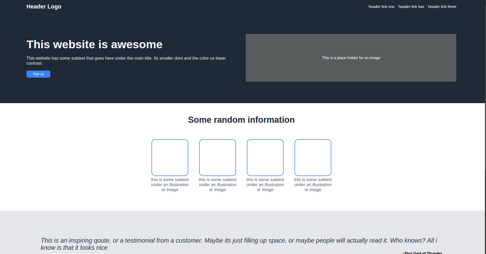

# Landing Page (Odin Project)

This is a simple landing page project built as part of [The Odin Project](https://www.theodinproject.com/) curriculum. It demonstrates fundamental HTML and CSS concepts, including flexbox layouts, responsive design, and basic styling.

## Features

- Responsive header with logo and navigation links
- Hero section with main text, subtext, and a call-to-action button
- Placeholder image area in the hero section
- Information section with illustration placeholders and descriptive text
- Testimonial/quote section
- Call-to-action banner
- Footer

## Getting Started

1. **Clone the repository:**
   ```sh
   git clone https://github.com/your-username/Landing-page-odin.git
   cd Landing-page-odin
   ```

2. **Open the project:**
   - Open `index.html` in your web browser, or
   - Open the folder in [Visual Studio Code](https://code.visualstudio.com/) for development.

## File Structure

- `index.html` — Main HTML file containing the page structure.
- `style.css` — CSS file for all styles and layout.

## Customization

- Replace the placeholder image and text with your own content as needed.
- Modify styles in `style.css` to change colors, spacing, or layout.

## Screenshots



## Credits

- Project based on [The Odin Project](https://www.theodinproject.com/) curriculum.
- Icons and images are placeholders; replace them with your own assets.

## License

This project is open source and available under